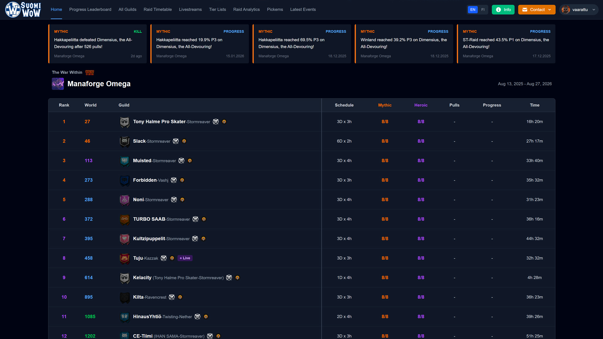

# WoW Guild Progress Tracker

A comprehensive platform for tracking World of Warcraft guild raid progression with live leaderboards, community competitions, and detailed analytics. Monitor multiple guilds simultaneously across current and historical raid tiers.




## 📋 Table of Contents

- [Overview](#-overview)
- [Key Features](#-key-features)
- [Tech Stack](#-tech-stack)
- [Getting Started](#-getting-started)
- [Configuration](#-configuration)
- [License](#-license)

## 🎮 Overview

This application provides real-time tracking and analytics for World of Warcraft raiding guilds. It aggregates data from WarcraftLogs to create competitive leaderboards, detailed performance metrics, and community engagement features like prediction competitions.

Originally focused on Finnish/Nordic guilds, the platform can be configured to track any guilds across all regions. It automatically updates progression data, tracks boss kills and attempts, and provides insights into guild performance across multiple raid tiers.

## ✨ Key Features

### 🏆 **Guild Leaderboards**

Track multiple guilds with real-time updates showing mythic and heroic progression, current boss attempts, and overall rankings.

### 🎯 **Pick'em Competitions**

Community prediction games where users vote on which guilds will clear raids first, complete with leaderboards and streak tracking.

### 📊 **Raid Analytics**

Detailed statistics including pull counts, time spent per boss, performance distributions, and comparative analysis across all tracked guilds.

### 🎖️ **Guild Tier Lists**

Performance-based rankings evaluating guilds on speed (world/realm rankings) and efficiency (pulls/time spent).

### 📡 **Live Events Feed**

Real-time updates for boss kills, progression milestones, and best pull attempts with timestamps and context.

### 📺 **Twitch Integration**

Live stream listings showing which tracked guilds are currently broadcasting their raids.

### 📈 **Guild Profiles**

Comprehensive pages for each guild showing progression history, boss-by-boss breakdowns, and detailed performance metrics across raid tiers.

## 🛠 Tech Stack

**Frontend:** Next.js 15, React 19, TypeScript, Tailwind CSS
**Backend:** Express.js, Node.js, TypeScript, MongoDB
**Data Sources:** WarcraftLogs, Blizzard Battle.net, Raider.IO, Twitch
**Deployment:** Docker Compose with Nginx

## � Getting Started

### Prerequisites

- **Node.js** v20+ (for local development)
- **MongoDB** v7.0+ (or MongoDB Atlas)
- **Docker** (recommended for easy setup)

### API Keys

You'll need API credentials from:

- [WarcraftLogs](https://www.warcraftlogs.com/api/clients/) - Combat log data
- [Blizzard Battle.net](https://develop.battle.net) - Icons and achievements
- [Raider.IO](https://raider.io/api) - Raid tier dates (optional)

### Quick Start with Docker

```bash
# Clone the repository
git clone https://github.com/Koodattu/wow-guild-progress-tracker.git
cd wow-guild-progress-tracker

# Configure environment
cd backend
cp .env.example .env
# Edit .env with your API keys

# Configure guilds to track
# Edit backend/src/config/guilds.ts

# Start everything
cd ..
docker-compose up --build
```

Visit http://localhost:3000 to view the application.

### Manual Setup

1. **Install dependencies**

   ```bash
   cd backend && npm install
   cd ../frontend && npm install
   ```

2. **Configure environment**
   - Copy `backend/.env.example` to `backend/.env`
   - Add your API credentials
   - Edit `backend/src/config/guilds.ts` to add guilds

3. **Start MongoDB** (if not using Docker)

4. **Start services**

   ```bash
   # Terminal 1 - Backend
   cd backend && npm run dev

   # Terminal 2 - Frontend
   cd frontend && npm run dev
   ```

## ⚙ Configuration

### Guilds to Track

Edit `backend/src/config/guilds.ts` to specify which guilds you want to track:

```typescript
export const GUILDS: TrackedGuild[] = [
  { name: "Guild Name", realm: "Server-Name", region: "EU" },
  { name: "Another Guild", realm: "Another-Server", region: "US" },
];
```

**Note:** Use hyphens for realm names with spaces (e.g., "Tarren Mill" → "Tarren-Mill")

### Raid Tiers

The `TRACKED_RAIDS` array in the same file contains WarcraftLogs zone IDs for raids to track. The first raid is considered the current tier.

### Environment Variables

Create `backend/.env` with your API credentials:

```env
MONGODB_URI=mongodb://localhost:27017/wow_guild_tracker
WCL_CLIENT_ID=your_warcraftlogs_client_id
WCL_CLIENT_SECRET=your_warcraftlogs_secret
BLIZZARD_CLIENT_ID=your_blizzard_client_id
BLIZZARD_CLIENT_SECRET=your_blizzard_secret
RAIDER_IO_API_KEY=your_raiderio_key  # optional
```

## 📄 License

This project is licensed under the MIT License - see the [LICENSE](LICENSE) file for details.
